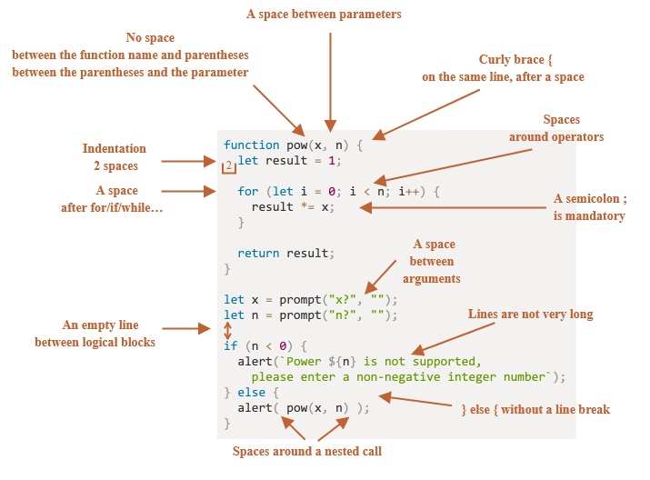

# Corso Javascript

Impariamo a usare Javascript conoscendone le basi


<!-- _paginate: false -->
<!-- _footer: "" -->
<!-- style: "
img[alt~='center'] {
  display: block;
  margin: 0 auto;
}
h2 {
    color: #e50000;
    position: absolute;
    top: 0px;
    background-color: white;
    width: 100%;
    left: 0;
    padding: 10px 0px 0px 75px;
    height: 65px;
    border-bottom: 1px solid red;
    margin: 0px;
}
h3 {
    color: #e50000;
}
footer {
    width: 100%;
    left: 5px;
    bottom: 0;
    padding: 0 0 10px 10px;
}
" -->

---

## Javascript - definizione

__JavaScript__ è un linguaggio di programmazione multi paradigma orientato agli eventi, comunemente utilizzato nella programmazione Web lato client (esteso poi anche al lato server) per la creazione, in siti web e applicazioni web, di effetti dinamici interattivi tramite funzioni di script invocate da eventi innescati a loro volta in vari modi dall'utente sulla pagina web in uso (mouse, tastiera, caricamento della pagina ecc...).

<https://it.wikipedia.org/wiki/JavaScript>

---

## Javascript - quando nasce

Originariamente sviluppato da __Brendan Eich__ della Netscape Communications con il nome di __Mochan__ e successivamente di __LiveScript__, in seguito è stato rinominato "JavaScript" ed è stato formalizzato con una sintassi più vicina a quella del linguaggio Java di Sun Microsystems (che nel 2010 è stata acquistata da Oracle).

Standardizzato per la prima volta il 1997 dalla ECMA con il nome ECMAScript, l'ultimo standard, di giugno 2021, è ECMA-262 Edition 12 ed è anche uno standard ISO (ISO/IEC 16262).

<https://it.wikipedia.org/wiki/JavaScript>

---

## Javascript – strumenti

Lo strumento che useremo durante il corso è

<https://codepen.io>

*CodePen is a social development environment. At its heart, it allows you to write code in the browser, and see the results of it as you build. A useful and liberating online code editor for developers of any skill, and particularly empowering for people learning to code. We focus primarily on front-end languages like HTML, CSS, JavaScript, and preprocessing syntaxes that turn into those things.*

Iscrivetevi e seguite il profilo creato apposta per il corso

<https://codepen.io/matteobaccan>

---

## Javascript – editor

Editor

- Codepen.io
- VisualStudio Code
- Codespace

Va bene qualsiasi editor, non visuale, meglio se con __syntax highlighter__ e code completion

Le slide e i sorgenti del corso, liberamente ispirati a <https://www.w3schools.com> e costantemente aggiornati, sono disponibili a questo indirizzo

<https://github.com/matteobaccan/CorsoJavascript>

---

## Javascript – esempio

```javascript
// Popup
alert('Hello, world!');

// Modifica pagina HMTL
document.write("Hello World");

// Log su console : visibile da F12 del browser (Mac: Cmd+Opt+I)
console.log("Hello World");
```

---

## Javascript può essere aggiunto ai documenti HTML in 2 modi

__Interno__: utilizzando un elemento __\<script\>__

__Esterno__: utilizzando un elemento __\<link\>__ per collegarsi a un file JS esterno

---

## Javascript interno

```html
<!DOCTYPE html>
<html>
 <head>
 </head>
 <body>
  <h1>Javascript</h1>

  <script>
    alert('Hello, world!');
  </script>

 </body>
</html>
```

---

## Javascript esterno

```html
<!DOCTYPE html>
<html>
 <head>

   <script src="script.js"></script>
   
 </head>
 <body>
  <h1>Javascript</h1>
 </body>
</html> 
```

---

## Javascript Debugger

Come tutti i linguaggi, uno degli strumenti più utili per capire come funziona il vostro programma è il debugger che è contenuto nei maggiori browser.

All’interno del codice javascript, in qualsiasi momento, è possibile fermare l’esecuzione e passare il controllo al debugger per verificare lo stato del programma.

Per fare questo è necessario utilizzare il comando

```javascript
debugger
```

---

## Coding style <https://javascript.info/coding-style>



---

## Javascript statement

Gli statement sono costrutti e comandi che comandano un’azione

```javascript
alert(‘Ciao’);
```

Per separare due statement possiamo inserire un __;__ oppure semplicemente andare a capo

```javascript
alert(‘Ciao2’)
alert(‘Ciao3’)
```

---

## Javascript commenti

I commenti in Javascript possono essere fatti in 2 modi:

Monoriga

```javascript
// Ciao sono un commento
alert(‘Ciao’);
```

Multiriga

```javascript
/*
Ciao sono un commento 
multiriga
*/
alert(‘Ciao’);
```

---

## Javascript - use strict

Per molto tempo, JavaScript si è evoluto senza problemi di compatibilità.
Sono state aggiunte nuove funzionalità, mentre le vecchie non venivano cambiate.

Ciò ha avuto il vantaggio di non violare mai il codice esistente. Ma il rovescio della medaglia che, qualsiasi errore o decisione imperfetta presa dai creatori di JavaScript, rimaneva bloccata nel linguaggio.

Nel 2009 è apparso ECMAScript 5 (ES5), che ha aggiunto nuove funzionalità e modificato alcune di quelle esistenti. Per mantenere il vecchio codice funzionante, la maggior parte di queste modifiche è disattivata per default.

Per abilitare le nuove funzionalità deve quindi essere aggiunta la direttiva:

```javascript
use strict
```

---

## Javascript - variabili

Una variabile è una zona di memoria per i dati con un proprio nome.

Possiamo utilizzare le variabili per memorizzare oggetti, numeri e altri dati.

Per creare una variabile in JavaScript si possono usare 3 modi diversi

```javascript
var = per variabili globale
let = per le variabili locale
const = per le costanti
```

La seguente istruzione dichiara una variabile locale con il nome "messaggio"

```javascript
let messaggio
```

---

## Javascript - datatype

Ci sono 8 tipi base in javascript. Essendo una variabile solo il nome di una zona di memoria, possiamo cambiarne il tipo in qualsiasi momento passando, ad esempio da numero a stringa di caratteri, senza avere errori.

Numeri (sia interi che a virgola mobile)

```javascript
let numero = 8;

numero = 3.14;
```

---

## Javascript - datatype limiti

In JavaScript, il tipo numero non può rappresentare valori interi maggiori di __Number.MAX_SAFE_INTEGER__ che rappresenta il valore di __9.007.199.254.740.991__ (ovvero 2<sup>53</sup> - 1) o inferiori a -(2<sup>53</sup>-1) per i negativi.
È una limitazione tecnica causata dalla loro rappresentazione interna a 64 bit (standard IEEE 754).

Per la maggior parte degli scopi è abbastanza, ma a volte abbiamo bisogno di numeri davvero grandi, ad es. per crittografia o timestamp con precisione di microsecondi.

Il tipo BigInt è stato recentemente aggiunto al linguaggio per rappresentare numeri interi di lunghezza arbitraria.

Un valore BigInt viene creato aggiungendo __n__ alla fine di un numero intero:

```javascript
let bigInt = 1234567890123456789012345678901234567890n;
```

---

## Javascript - datatype stringhe

Una stringa in JavaScript deve essere racchiusa tra virgolette.

Esistono 3 tipi di virgolette

```javascript
Doppie: "Hello"

Singole: 'Hello'

Backtick: `Hello`
```

Il backtick è ottenibile con ALT + 96
Su Mac è possibile ottenerlo con __Alt__ + __\\__ oppure __Alt__ + __9__ e successivamente __spazio__

---

## Javascript - datatype stringhe virgolette

Il comportamento delle stringhe è diverso in base al tipo di virgolette utilizzate

```javascript
let str = "ciao";

let str2 = 'ciao a singola virgoletta';

let frase = `inserisco una stringa ${str}`;
```

---

## Javascript operazioni numeriche

Le operazioni numeriche in javascript sono fatte tramite operatori

```javascript
= assegnazione
+ somma
- sottrazione
* moltiplicazione
** esponente
% modulo
++ incremento di 1
-- decremento di 1
```

---

## Javascript operazioni numeriche esempi

Le operazioni numeriche possono essere riferite alla stessa variabile

```javascript
let a = 100
```

L’aggiunta di 10 alla variabile può essere fatta in 2 modi diversi

```javascript
a = a +10
a += 10
```

```javascript
+= somma e assegnazione
-= sottrazione e assegnazione
*= moltiplicazione e assegnazione
**= esponente e assegnazione
...
```

---

## Javascript oggetti

Oltre alle stringhe e ai numeri

```javascript
let numero = 16;
let stringa = "matteo";
```

In javascript è possibile definire anche degli oggetti

```javascript
let oggetto = {nome:"Matteo", cognome:"Baccan"};
```

Per poi accedere ai singoli valori in modo diretto

```javascript
oggetto.nome
oggetto.cognome
```

---

## Javascript array

Quando dobbiamo lavorare con delle liste di valori, possiamo utilizzare gli array

```javascript
const auto = ["Fiat", "Volvo", "BMW"];
```

Per poi accedere ai singoli elementi, possiamo utilizzarne l’indice, con base 0

```javascript
auto[0] // per accedere al valore Fiat
```

---

## Javascript funzioni

Se vogliamo creare dei programmi, possiamo creare delle funzioni specializzate nell'eseguire piccoli compiti.

La sintassi delle funzioni è:

```javascript
function nome(parametro1, parametro2, parametro3) {
  // Codice da eseguire
}
```

---

## Javascript eventi

Il modo col quale possiamo interagire con delle pagine HTML è tramite l’uso di eventi

```javascript
onchange    Al cambio dell’elemento HTML
onclick     Al click sull'elemento HTML
onmouseover Quando il mouse viene mosso sull'elemento HTML
onmouseout  Quando il mouse viene mosso fuori dall'elemento HTML
onkeydown   Quando viene premuto un tasto
onload      Al termine del caricamento della pagina
```

---

## Javascript eventi esempio

L'uso degli eventi è molto semplice, basta aggiungere l'attributo onclick all'elemento HTML ed assegnargli una funzione

```javascript
<button onclick="myFunction()">Click me</button>
```

```javascript
function myFunction() {
  alert("Hello World!");
}
```

---

## Javascript window

L'oggetto window rappresenta una finestra aperta in un browser.

```javascript
document        Restituisce il document object
history         Restituisce l’oggetto history
externalHeight  Restituisce l'altezza della finestra del browser, 
                incluse le barre degli strumenti/scrollbar
outerWidth      Restituisce la larghezza della finestra del browser, 
                incluse le barre degli strumenti/barre di scorrimento
alert()         Visualizza una finestra di avviso con un messaggio e un pulsante OK
confirm()       Visualizza una finestra di dialogo con un messaggio e un pulsante OK e Annulla
```

<https://www.w3schools.com/jsref/obj_window.asp>

---

## Javascript document

Quando un documento HTML viene caricato in un browser Web, diventa un oggetto document

```javascript
getElementById()            L'elemento che ha l'attributo ID con il valore specificato
getElementsByClassName()    Una HTMLCollection contenente tutti gli elementi con il nome di
                            classe specificato
getElementsByName()         Una NodeList live contenente tutti gli elementi con il nome specificato
getElementsByTagName()      Una HTMLCollection contenente tutti gli elementi con il nome del
                            tag specificato
querySelector()             Il primo elemento che corrisponde a uno o più selettori CSS specificati
                            nel documento
querySelectorAll()          Una NodeList statica contenente tutti gli elementi che corrispondono
                            a uno o più selettori CSS specificati nel documento
```

<https://www.w3schools.com/jsref/prop_win_document.asp>

---

## Javascript l'evento DOMContentLoaded

L'evento DOMContentLoaded viene eseguito quando il documento HTML è stato completamente caricato e analizzato, senza attendere il caricamento di fogli di stile, immagini e frame.

```javascript
document.addEventListener("DOMContentLoaded", function(event) {
  console.log("DOM completamente caricato e analizzato");
});
```

Scrivere il proprio codice all'interno di questo evento è una buona pratica, in quanto assicura che il codice venga eseguito solo dopo che il documento è stato completamente caricato, evitando errori.

---

## Fonti

<https://www.w3schools.com> : argomenti ed idee per esempi
<https://it.wikipedia.org> : definizioni e argomenti

Ogni immagine inserita riporta la fonte di provenienza

---

## Disclaimer

Questo materiale è stato realizzato con le seguenti modalità:

- Contenuto testuale
Redatto attraverso sistemi di AI per la generazione della bozza iniziale, successivamente rielaborato, verificato e integrato manualmente dall'autore.

- Elementi grafici
L'immagine di sfondo è stata generata tramite [Haikei.app](https://app.haikei.app). Eventuali altri elementi visivi derivano da banche immagini royalty-free o creazioni originali.

- Ricerche
I dati e le informazioni citate sono state raccolte da fonti pubbliche accessibili online, selezionate e contestualizzate in modo critico dall'autore.

La direzione intellettuale, le scelte contenutistiche e l'accuratezza delle informazioni restano sotto la piena responsabilità dell'autore.
